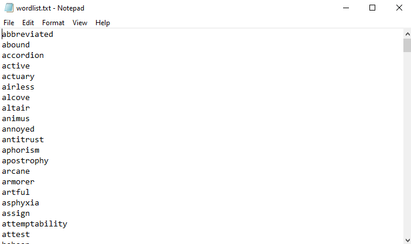
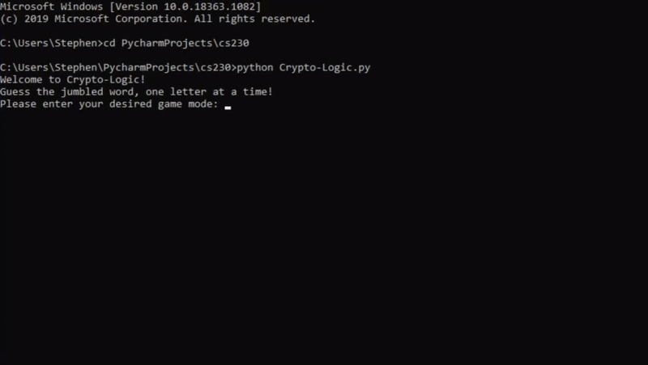

# Crypto-Logic #

Crypto-Logic is a simple word jumble game in Python. A word is chosen at random from a text file and the letters are scrambled. The objective is to correctly solve the word in the fastest time and with the smallest number of incorrect guesses.

# Description #

There are four game modes available:
* Easy: All words will be 6 letters in length or shorter
* Medium: All words will be 7 letters in length
* Hard: All words will be 8 letters in length or longer
* Dyslexia: Any word from the word bank can be chosen but the letters will not be scrambled

The text file "wordlist.txt" contains a bank of 300 words to be used for the game.

Once a word is chosen at random, it is removed from "wordlist.txt" and added to the text file "guessedwords.txt". For all game modes except Dyslexia, the letters of the word will be shuffled.

The game tracks the time, in seconds, as well as the number of incorrect guesses until the user correctly solves the word which will be shown once the user has correctly solved the word.

# Installation #

## Windows ##
1. Hold down the windows key and the 'r' key
2. > cmd
3. Navigate to the directory containing the repository
4. > python Crypto-Logic.py

## Mac ##
1. Hold down the cmd key and the space bar
2. > terminal
3. Navigate to the directory containing the repository
4. > python Crypto-Logic.py

**The text files "wordlist.text" and "guessedwords.txt" must be stored in the same folder as the Crypto-Logic.py file in order for the program to work successfully.**

# Requirements #

Python 3.0 or later
